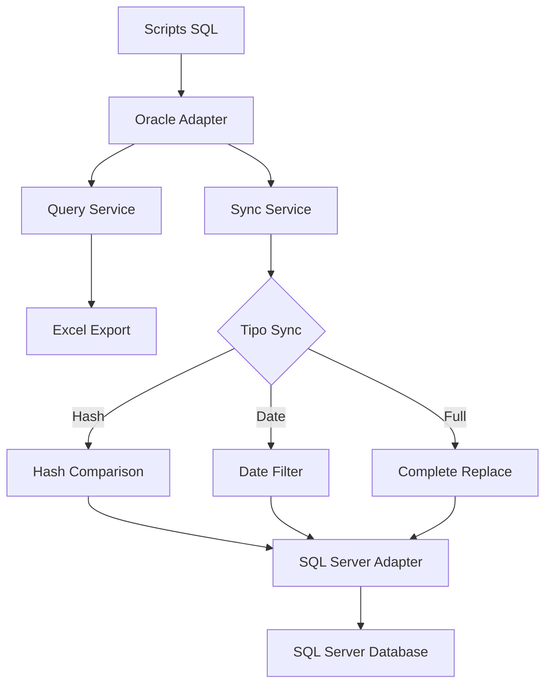

# 🏢 DGBienes - Sistema Multi-Schema de Sincronización Oracle → SQL Server

Sistema completo de extracción, transformación y sincronización de datos desde múltiples esquemas Oracle hacia SQL Server, con capacidades de exportación a Excel y sincronización incremental inteligente.

## 📋 Tabla de Contenidos

- [Características Principales](#-características-principales)
- [Entornos Soportados](#-entornos-soportados)
- [Requisitos del Sistema](#-requisitos-del-sistema)
- [Instalación](#-instalación)
- [Configuración](#-configuración)
- [Uso](#-uso)
- [Comandos Principales](#-comandos-principales)
- [Arquitectura del Sistema](#-arquitectura-del-sistema)
- [Troubleshooting](#-troubleshooting)
- [Logging y Monitoreo](#-logging-y-monitoreo)
- [Configuración Avanzada](#-configuración-avanzada)

---

## 🚀 Características Principales

### **Multi-Entorno Inteligente**
- ✅ **Bienes**: Gestión de bienes inmuebles y carteras
- ✅ **Concesiones**: Sistema de concesiones y adjudicaciones  
- ✅ **SIGAF**: Sistema Integrado de Gestión Administrativa y Financiera
- ✅ **SIGAF Devengados**: Módulo especializado en devengados

### **Sincronización Avanzada**
- 🔄 **Incremental por Hash**: Evita duplicados usando hash MD5 de registros
- 📅 **Incremental por Fecha**: Sincronización basada en campos de fecha
- 🔧 **Sincronización Completa**: Reemplazo total de datos cuando es necesario
- 📊 **Detección Automática**: El sistema determina el mejor método por tabla

### **Conectividad Robusta**
- 🔗 **Oracle**: Soporte completo con Oracle Instant Client
- 🔗 **SQL Server**: Compatible con ODBC Driver 17 y 18
- 🔐 **SSL/Certificados**: Manejo automático de certificados auto-firmados
- 🛡️ **Failover**: Manejo inteligente de errores de conexión

### **Exportación Flexible**
- 📈 **Excel**: Archivos individuales por consulta con formato optimizado
- 🗄️ **SQL Server**: Sincronización directa a base de datos
- 🔀 **Modo Híbrido**: Excel + SQL Server simultáneamente

---

## 🌐 Entornos Soportados

| Entorno | Esquemas Oracle | Tablas SQL Server | Estado |
|---------|----------------|-------------------|--------|
| **Bienes** | `bienes`, `fade2` | `Bienes_01_BENEFICIARIOS`, `Bienes_02_CARTERAS`, etc. | ✅ Activo |
| **Concesiones** | `fade` | `Concesiones_01_BENEFICIARIOS`, `Concesiones_02_CARTERAS`, etc. | ✅ Activo |
| **SIGAF** | `slu` | `[01_RELACION_BAC_SIGAF]`, `[02_SPR_RENGLONES]`, etc. | ✅ Activo |
| **SIGAF Devengados** | `slu` | `[01_DEVENGADO_v2]` | ✅ Activo |

---

## 💻 Requisitos del Sistema

### **Software Base**
- **Python 3.8+** (Recomendado 3.12)
- **Oracle Instant Client 21.11+** (64-bit)
- **ODBC Driver 17 o 18 for SQL Server**

### **Librerías Python**
```txt
oracledb>=1.3.0
python-dotenv>=1.0.0
pandas>=2.0.0
openpyxl>=3.1.0
SQLAlchemy>=2.0.0
pyodbc>=4.0.0
pymssql>=2.2.0
```

### **Acceso de Red**
- ✅ Conectividad a Oracle (puerto 1521)
- ✅ Conectividad a SQL Server (puerto 1433)
- ✅ Permisos de lectura en esquemas Oracle
- ✅ Permisos de escritura en SQL Server

---

## 📦 Instalación

### **1. Clonar Repositorio**
```bash
git clone <repo_url> DGBienes
cd DGBienes
```

### **2. Entorno Virtual**
```bash
# Crear entorno virtual
python -m venv .venv

# Activar (Windows)
.venv\Scripts\Activate.ps1

# Activar (Linux/macOS)
source .venv/bin/activate
```

### **3. Instalar Dependencias**
```bash
pip install -r requirements.txt
```

### **4. Oracle Instant Client**
- **Descargar**: [Oracle Instant Client](https://www.oracle.com/database/technologies/instant-client/downloads.html)
- **Instalar**: Extraer en `C:\oracle\instantclient_XX_X`
- **Configurar**: Agregar al PATH del sistema

### **5. ODBC Driver SQL Server**
- **Descargar**: [ODBC Driver 18 for SQL Server](https://learn.microsoft.com/en-us/sql/connect/odbc/download-odbc-driver-for-sql-server)
- **Instalar**: Versión de 64-bit
- **Verificar**: Ejecutar `python check_odbc_drivers.py`

---

## ⚙️ Configuración

### **Estructura de Archivos de Configuración**
```
DGBienes/
├── .env.bienes          # Configuración para Bienes
├── .env.concesiones     # Configuración para Concesiones  
├── .env.sigaf           # Configuración para SIGAF
├── .env.sigaf_devengado # Configuración para SIGAF Devengados
└── .env.default         # Configuración base (opcional)
```

### **Ejemplo de Configuración (.env.bienes)**
```bash
####################Bienes#####################
# Configuración Oracle
DB_HOST=10.15.7.45
DB_PORT=1521
DB_SERVICE=vivp
DB_USER=CONSUL_BIENES
DB_PASS=DGUIAF_2025$$

# Configuración SQL Server
SQLSERVER_HOST=10.15.0.28
SQLSERVER_DB=DGBIDB
SQLSERVER_USER=gsolomita
SQLSERVER_PASS=Dguiaf2025
SQLSERVER_DRIVER={ODBC Driver 18 for SQL Server}

# Configuración de Archivos
PATH_SQL=sql/Bienes
FILE_XLSX=output/Bienes

# Opciones de Sincronización
SYNC_TO_SQLSERVER=true
EXPORT_TO_EXCEL=true
SYNC_MODE=incremental

# Configuración de Hash
USE_HASH_SYNC=true
HASH_TABLES=Bienes_01_BENEFICIARIOS,Bienes_02_CARTERAS

# Performance
BATCH_SIZE=1000
COMMIT_INTERVAL=1000
MAX_RETRIES=3

# Logging
LOG_LEVEL=INFO
LOG_FILE=logs/bienes_sync.log

# Entorno
APP_ENV=bienes
```

### **Variables de Configuración**

| Variable | Descripción | Ejemplo | Requerido |
|----------|-------------|---------|-----------|
| `DB_HOST` | Servidor Oracle | `10.15.7.45` | ✅ |
| `DB_SERVICE` | Servicio Oracle | `vivp` | ✅ |
| `DB_USER` | Usuario Oracle | `CONSUL_BIENES` | ✅ |
| `DB_PASS` | Contraseña Oracle | `password123` | ✅ |
| `SQLSERVER_HOST` | Servidor SQL Server | `10.15.0.28` | ✅ |
| `SQLSERVER_DRIVER` | Driver ODBC | `{ODBC Driver 18 for SQL Server}` | ✅ |
| `SYNC_MODE` | Modo sincronización | `incremental`/`full` | ⚠️ |
| `HASH_TABLES` | Tablas con hash | `tabla1,tabla2` | ⚠️ |

---

## 🎯 Uso

### **Configurar Entorno**
```powershell
# Windows PowerShell
$Env:APP_ENV = 'bienes'
$Env:APP_ENV = 'sigaf'
# Linux/macOS  
export APP_ENV=bienes
```

### **Comandos Básicos**
```bash
# Información del entorno
python main.py --info

# Listar entornos disponibles
python main.py --list-envs

# Estado de sincronización
python main.py --status

# Conteo de registros
python count_records.py
```

### **Sincronización Completa**
```bash
# Solo Excel
python main.py --mode excel

# Solo SQL Server
python main.py --mode sqlserver

# Ambos (Excel + SQL Server)
python main.py --mode both
```

### **Sincronización Incremental**
```bash
# Incremental (por defecto)
python main.py --sync-mode incremental

# Completa (reemplaza todo)
python main.py --sync-mode full
```

### **Tablas Específicas**
```bash
# Sincronizar tablas específicas
python main.py --tables Bienes_01_BENEFICIARIOS Bienes_02_CARTERAS

# Con modo específico
python main.py --mode sqlserver --tables "[01_RELACION_BAC_SIGAF]"
```

---

## 📋 Comandos Principales

### **🔧 Comandos de Información**
```bash
# Ver configuración actual
python main.py --info

# Estado de todas las tablas
python main.py --status

# Listar entornos disponibles  
python main.py --list-envs

# Verificar drivers ODBC
python check_odbc_drivers.py

# Contar registros por entorno
python count_records.py
```

### **📊 Comandos de Sincronización**
```bash
# Sincronización completa (Excel + SQL Server)
python main.py

# Solo generar archivos Excel
python main.py --mode excel

# Solo sincronizar a SQL Server
python main.py --mode sqlserver --sync-mode incremental

# Sincronización completa (reemplazar todo)
python main.py --mode both --sync-mode full

# Tablas específicas
python main.py --tables "09_PRD_FACTURAS" --sync-mode incremental
```

### **🎯 Comandos por Entorno**
```bash
# BIENES
$Env:APP_ENV = 'bienes'
python main.py --mode both

# CONCESIONES  
$Env:APP_ENV = 'concesiones'
python main.py --mode both

# SIGAF
$Env:APP_ENV = 'sigaf'
python main.py --mode sqlserver --sync-mode incremental

# SIGAF DEVENGADOS
$Env:APP_ENV = 'sigaf_devengado'
python main.py --status
```

---

## 🏗️ Arquitectura del Sistema

### **Estructura del Proyecto**
```
DGBienes/
├── adapters/                    # Adaptadores de base de datos
│   ├── db_adapter.py           # Conexión Oracle
│   └── sqlserver_adapter.py    # Conexión SQL Server
├── config/
│   └── settings.py             # Gestión de configuración
├── services/                   # Lógica de negocio
│   ├── query_service.py        # Exportación a Excel
│   ├── sync_service.py         # Sincronización SQL Server
│   └── environment_manager.py  # Gestión de entornos
├── sql/                        # Scripts SQL organizados
│   ├── Bienes/                # Consultas de Bienes
│   ├── Concesiones/           # Consultas de Concesiones
│   ├── Sigaf/                 # Consultas de SIGAF
│   └── Sigaf_Devengados/      # Consultas de Devengados
├── output/                     # Archivos Excel generados
├── logs/                       # Archivos de log
├── .env.*                      # Configuraciones por entorno
├── main.py                     # Punto de entrada principal
├── count_records.py            # Herramienta de conteo
└── requirements.txt            # Dependencias Python
```

### **Flujo de Datos**


### **Métodos de Sincronización**

#### **1. Sincronización por Hash (Recomendado)**
- 🔍 **Detección**: Calcula hash MD5 de cada registro
- ⚡ **Velocidad**: Solo inserta registros nuevos o modificados
- 🎯 **Precisión**: Detecta cambios en cualquier columna
- 📋 **Tablas**: Bienes, Concesiones, SIGAF (mayoría)

#### **2. Sincronización por Fecha**
- 📅 **Método**: Usa columnas de fecha para filtrar
- 🔄 **Incremental**: Solo datos posteriores a última sincronización
- 📋 **Tablas**: SIGAF Devengados (`fh_imputacion`)

#### **3. Sincronización Completa**
- 🔄 **Método**: Reemplaza todos los datos
- ⚠️ **Uso**: Cuando hay cambios estructurales
- 🕐 **Tiempo**: Más lento pero garantiza consistencia

---

## 🔧 Troubleshooting

### **Errores Comunes y Soluciones**

#### **🔗 Errores de Conexión Oracle**
```
❌ Error: DPI-1047: Cannot locate a 64-bit Oracle Client library
```
**Solución:**
1. Descargar Oracle Instant Client 64-bit
2. Extraer en `C:\oracle\instantclient_XX_X`
3. Agregar al PATH del sistema
4. Reiniciar PowerShell

#### **🔗 Errores de Conexión SQL Server**
```
❌ Error: Data source name not found and no default driver specified
```
**Solución:**
1. Instalar ODBC Driver 18 for SQL Server
2. Verificar con: `python check_odbc_drivers.py`
3. Actualizar `SQLSERVER_DRIVER` en `.env`

```
❌ Error: SSL Provider: The certificate chain was issued by an authority that is not trusted
```
**Solución:**
✅ **Automática**: El sistema agrega `TrustServerCertificate=yes` automáticamente

#### **📊 Errores de Sincronización**
```
❌ Error: Cannot insert the value NULL into column
```
**Solución:**
1. El sistema limpia automáticamente valores NULL
2. Si persiste, verificar estructura de tabla en SQL Server
3. Usar: `python main.py --tables tabla_problema`

#### **💾 Errores de Archivos**
```
❌ Error: Permission denied: 'output/archivo.xlsx'
```
**Solución:**
1. Cerrar archivos Excel abiertos
2. Verificar permisos de carpeta `output/`
3. Ejecutar como administrador si es necesario

### **🔍 Diagnóstico Paso a Paso**

#### **1. Verificar Configuración**
```bash
python main.py --info
```

#### **2. Probar Conexiones**
```bash
# Oracle
python -c "from adapters.db_adapter import get_oracle_session; print('Oracle OK' if get_oracle_session() else 'Oracle FAIL')"

# SQL Server  
python -c "from adapters.sqlserver_adapter import SQLServerAdapter; print(SQLServerAdapter().test_connection() or 'SQL Server FAIL')"
```

#### **3. Verificar Tablas**
```bash
python count_records.py
```

#### **4. Modo Debug**
```bash
# Agregar a .env
LOG_LEVEL=DEBUG

# Ejecutar
python main.py --mode sqlserver
```

---

## 📝 Logging y Monitoreo

### **Niveles de Log**
- **DEBUG**: Información detallada para desarrollo
- **INFO**: Información general de operación (predeterminado)
- **WARNING**: Advertencias que no detienen la ejecución
- **ERROR**: Errores que pueden afectar la sincronización

### **Archivos de Log**
```
logs/
├── bienes_sync.log         # Logs específicos de Bienes
├── concesiones_sync.log    # Logs específicos de Concesiones
├── sigaf_sync.log          # Logs específicos de SIGAF
└── dgbienes.log            # Log general del sistema
```

### **Monitoreo en Tiempo Real**
```bash
# Windows PowerShell
Get-Content logs\bienes_sync.log -Tail 10 -Wait

# Linux/macOS
tail -f logs/bienes_sync.log
```

### **Ejemplo de Log de Sincronización**
```
2025-08-01 11:04:12 - INFO - === DGBienes Multi-Schema Iniciado ===
2025-08-01 11:04:12 - INFO - Entorno: BIENES
2025-08-01 11:04:12 - INFO - 🚀 Iniciando sincronización en modo: incremental
2025-08-01 11:04:13 - INFO - 🔄 Procesando: Bienes_01_BENEFICIARIOS.sql
2025-08-01 11:04:13 - INFO - 📊 Usando sincronización por HASH
2025-08-01 11:04:14 - INFO - ✅ Bienes_01_BENEFICIARIOS: 1,234 registros sincronizados
2025-08-01 11:04:15 - INFO - 📋 RESUMEN: 4 tablas | 5,678 registros totales
```

---

## ⚙️ Configuración Avanzada

### **Variables de Performance**
```bash
# Tamaño de lote para inserción
BATCH_SIZE=1000              # Registros por lote

# Intervalo de commit  
COMMIT_INTERVAL=1000         # Commits cada N registros

# Reintentos en caso de error
MAX_RETRIES=3                # Número de reintentos

# Timeout de conexión
CONNECTION_TIMEOUT=30        # Segundos
```

### **Configuración de Hash**
```bash
# Habilitar sincronización por hash
USE_HASH_SYNC=true

# Tablas que usan hash (separadas por coma)
HASH_TABLES=Bienes_01_BENEFICIARIOS,Bienes_02_CARTERAS

# Campos a excluir del hash
HASH_EXCLUDE_FIELDS=id,row_hash,fecha_registro
```

### **Filtros por Entorno**
```bash
# Días hacia atrás para datos incrementales
DATE_RANGE_DAYS=365

# Filtros de estado (para SIGAF)
STATUS_FILTERS=e_ocompra = 'A'

# Filtros de jurisdicción
ENTITY_FILTERS=c_juris = 50
```

### **Configuración SSL/Certificados**
```bash
# Para ODBC Driver 18 (automático)
TRUST_SERVER_CERTIFICATE=yes
ENCRYPT=yes

# Para conexiones legacy
TRUST_SERVER_CERTIFICATE=no
ENCRYPT=optional
```

---

## 🚀 Programación Automática

### **Windows Task Scheduler**
```xml
<!-- Ejemplo de tarea programada -->
<Task>
  <Triggers>
    <CalendarTrigger>
      <StartBoundary>2025-01-01T06:00:00</StartBoundary>
      <ScheduleByDay>
        <DaysInterval>1</DaysInterval>
      </ScheduleByDay>
    </CalendarTrigger>
  </Triggers>
  <Actions>
    <Exec>
      <Command>python</Command>
      <Arguments>main.py --mode both --sync-mode incremental</Arguments>
      <WorkingDirectory>C:\DGBienes</WorkingDirectory>
    </Exec>
  </Actions>
</Task>
```

### **Script PowerShell para Automatización**
```powershell
# sync_all_environments.ps1
$environments = @('bienes', 'concesiones', 'sigaf', 'sigaf_devengado')

foreach ($env in $environments) {
    Write-Host "🚀 Sincronizando entorno: $env"
    $Env:APP_ENV = $env
    
    python main.py --mode both --sync-mode incremental
    
    if ($LASTEXITCODE -eq 0) {
        Write-Host "✅ $env sincronizado correctamente"
    } else {
        Write-Host "❌ Error en $env" -ForegroundColor Red
    }
}
```

---

## 🤝 Contribución y Mantenimiento

### **Estructura de Commits**
```bash
# Tipos de commit
feat: nueva funcionalidad
fix: corrección de errores  
docs: documentación
refactor: refactorización
test: pruebas
chore: mantenimiento
```

### **Agregar Nuevo Entorno**
1. Crear archivo `.env.nuevo_entorno`
2. Agregar mapeo en `sync_service.py`
3. Crear carpeta `sql/Nuevo_Entorno/`
4. Actualizar `environment_manager.py`

### **Agregar Nueva Tabla**
1. Crear archivo `.sql` en carpeta correspondiente
2. Agregar mapeo en `sync_config`
3. Configurar método de sincronización (hash/date)
4. Probar con tabla específica

---

## 📄 Licencia

Este proyecto está bajo la **Licencia MIT**. Ver archivo `LICENSE` para más detalles.

---

## 📞 Soporte

Para problemas o consultas:
1. **Logs**: Revisar archivos en `logs/`
2. **Diagnóstico**: Ejecutar `python main.py --info`
3. **Estado**: Verificar con `python main.py --status`
4. **Documentación**: Este README tiene toda la información necesaria

---

**Última actualización**: Agosto 2025  
**Versión**: 2.0  
**Compatibilidad**: Python 3.8+, Oracle 19c+, SQL Server 2016+